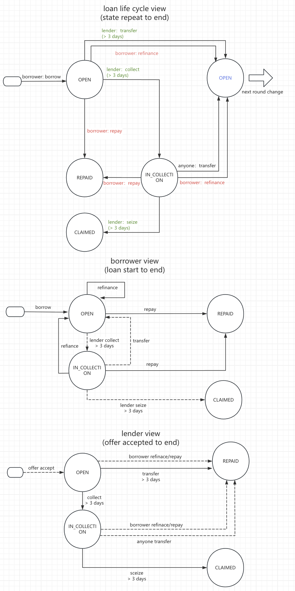

# LendingPoolV2 Smart Contract Security Audit Report

**Date**: 2026-01-01<br>
**Auditor**: Claude (AI Assistant)<br>
**Contract**: LendingPoolV2.sol<br>
**Version**: Latest (as of audit date)

---

## Executive Summary

This audit reviews the LendingPoolV2 smart contract with focus on:
1. Function modifier completeness and correctness
2. Balance accounting integrity
3. State transition logic
4. Potential attack vectors and vulnerabilities

**Overall Assessment**: The contract demonstrates strong security fundamentals with comprehensive reentrancy protection, proper access controls, and sound accounting logic. Several medium and low severity issues were identified that should be addressed before production deployment.

**Note on Resolution Functions**: The resolution functions (`resolveLoan`, `resolveAlpha`) follow a documented design pattern where the manager performs off-chain unstaking before calling the contract. This is detailed in README.md Section 3 "Asset Distribution During Resolution". While this creates a trust dependency on the manager role, it is an intentional design decision that is properly documented.

**Note on Protocol Fees**: The protocol fee accounting model is thoroughly documented in README.md Section 8.2 with mathematical invariants and detailed explanation. The implementation is correct.

---

## Audit Findings

### 🟡 MEDIUM Severity Issues

#### M1: Interest Rate Manipulation in Transfer During IN_COLLECTION

**Location**: Line 405
**Severity**: MEDIUM
**Status**: ⚠️ Borrower Protection Needed

**Description**:
Interest rate limit only applies during IN_COLLECTION state (150% of current rate). However, this protection has a loophole.

```solidity
require(_offer.dailyInterestRate <= oldOffer.dailyInterestRate * 150 / 100, "day rate too high");
```

**Issue**:
- Applies to ALL transfers, even when initiated by original lender in OPEN state
- Original lender can transfer to themselves with a new offer at 150% rate after MIN_LOAN_DURATION
- Then immediately put loan into collection and transfer again at 150% of new rate

**Attack Scenario**:
1. Loan starts at 0.5% daily rate
2. After MIN_LOAN_DURATION, lender transfers to self at 0.75% (150%)
3. Lender calls collect() immediately
4. Lender transfers to self again at 1.125% (150% of 0.75%)
5. Repeat to escalate rate

**Recommendation**:
```solidity
if (msg.sender == oldOffer.lender) {
    // Original lender has no rate restrictions when transferring from OPEN
    if (loanData.state == STATE.OPEN) {
        require(block.number > loanData.startBlock + MIN_LOAN_DURATION, "too early");
        // No rate restriction for original lender in OPEN state
    } else {
        // IN_COLLECTION: rate limit applies
        require(_offer.dailyInterestRate <= oldOffer.dailyInterestRate * 150 / 100, "day rate too high");
    }
} else {
    // Third party: must be IN_COLLECTION and rate limited
    require(loanData.state == STATE.IN_COLLECTION, "not collecting");
    require(_offer.dailyInterestRate <= oldOffer.dailyInterestRate * 150 / 100, "day rate too high");
}
```

---

#### M2: No Maximum Loan Duration Enforcement

**Location**: All loan functions
**Severity**: MEDIUM
**Status**: ⚠️ Risk of Infinite Loans

**Description**:
Loans can remain OPEN indefinitely. Interest accrues forever without upper bound.

**Impact**:
- A borrower could keep a loan open for years if never collected
- Interest calculation could overflow (though unlikely with reasonable rates)
- Lenders have no guaranteed collection timeline

**Recommendation**:
1. Add `MAX_LOAN_DURATION` constant (e.g., 365 days / ~2.6M blocks)
2. Allow anyone to call `collect()` after MAX_LOAN_DURATION, not just lender
3. Or add automatic expiration after which loan can be seized without collection period

---

#### M3: Refinance Can Bypass MIN_LOAN_AMOUNT for Net Borrowing

**Location**: Line 468
**Severity**: MEDIUM
**Status**: ⚠️ Rule Inconsistency

**Description**:
`refinance` checks that `_newLoanAmount >= MIN_LOAN_AMOUNT` but doesn't check the net additional borrowing amount.

```solidity
require(_newLoanAmount >= MIN_LOAN_AMOUNT, "loan too small");
```

**Issue**:
- If `repayAmount = 1.0 TAO` and `_newLoanAmount = 1.0 TAO`, the check passes
- But borrower is effectively borrowing 0 additional TAO (or paying off existing loan)
- Inconsistent with the MIN_LOAN_AMOUNT intent (prevent dust loans)

**Example**:
- Original loan: 0.5 TAO
- After interest: 0.51 TAO owed
- Refinance to: 1.0 TAO (passes check)
- Net new borrowing: 1.0 - 0.51 = 0.49 TAO (below MIN_LOAN_AMOUNT)

**Recommendation**:
```solidity
if (_newLoanAmount > repayAmount) {
    uint256 netBorrowing = _newLoanAmount - repayAmount;
    require(netBorrowing >= MIN_LOAN_AMOUNT, "net borrow too small");
}
// If _newLoanAmount <= repayAmount, it's a partial repayment, which is acceptable
```

---

#### M4: No Prevention of Double-Resolution

**Location**: Lines 769-836 (`resolveLoan`, `resolveAlpha`)
**Severity**: MEDIUM
**Status**: ⚠️ Trust Assumption

**Description**:
While the resolution process is documented in README.md Section 3, the contract does not prevent a loan or user's ALPHA from being resolved multiple times.

**Issue**:
```solidity
function resolveLoan(uint256 _loanId, ...) {
    // No check if this loan was already resolved
    _requireLoanActive(loanData);  // Only checks OPEN or IN_COLLECTION
    // ...
}
```

**Attack Scenario** (requires compromised manager):
1. Manager resolves loan once correctly
2. Manager calls `resolveLoan` again on the same loan
3. If loan state wasn't properly updated or manager manipulates TAO balance, double distribution occurs

**Current Protection**:
- Line 787: `_updateLoanData(loanData, STATE.RESOLVED)` - sets state to RESOLVED
- `_requireLoanActive` should reject RESOLVED state on second call

**Analysis**:
Actually, the code **DOES** have protection via state transition to RESOLVED. However, this could be made more explicit.

**Recommendation**:
1. Add explicit check: `require(loanData.state != STATE.RESOLVED, "already resolved")`
2. Add `mapping(uint256 => bool) public resolvedLoans` for transparency
3. Add similar protection for `resolveAlpha` to track resolved users per subnet

**Risk Level**: Low given current protections, but Medium due to lack of explicit safeguards

---

### 🟢 LOW Severity Issues

#### L1: Missing Zero Address Checks in Constructor

**Location**: Lines 267-284
**Severity**: LOW
**Status**: ⚠️ Deployment Risk

**Description**:
Constructor doesn't validate input addresses for zero address.

```solidity
constructor(
    bytes32 _delegateHotkey,
    bytes32 _treasuryColdkey,
    bytes32 _feeReceiverColdkey,
    address _manager,
    uint256 _minLoanDuration
) Ownable(msg.sender) {
    DELEGATE_HOTKEY = _delegateHotkey;  // No zero check
    TREASURY_COLDKEY = _treasuryColdkey;  // No zero check
    FEE_RECEIVER_COLDKEY = _feeReceiverColdkey;  // No zero check
    MANAGER = _manager;  // No zero check
    // ...
}
```

**Impact**:
- If zero values passed, contract would be permanently misconfigured
- Requires redeployment to fix

**Recommendation**:
```solidity
require(_delegateHotkey != bytes32(0), "zero delegate");
require(_treasuryColdkey != bytes32(0), "zero treasury");
require(_feeReceiverColdkey != bytes32(0), "zero fee receiver");
require(_manager != address(0), "zero manager");
```

---

#### L2: Offer Nonce Cannot Be Decremented

**Location**: Lines 595-600
**Severity**: LOW
**Status**: ℹ️ Usability Issue

**Description**:
`cancel()` increments lender nonce but there's no way to decrement it. If lender accidentally calls `cancel()` multiple times, all pre-signed offers become invalid.

**Impact**:
- Lender loses all off-chain signed offers
- Must re-sign all offers with new nonce
- Poor UX

**Recommendation**:
1. Document this behavior clearly in comments and user docs
2. Consider adding a `setNonce(uint256 _nonce)` function with restrictions (e.g., can only increase)
3. Or use per-offer cancellation exclusively

---

#### L3: No Event Emission Tracking for Pause Status

**Location**: Lines 291-309
**Severity**: LOW
**Status**: ℹ️ Monitoring Issue

**Description**:
While `SetPauseStatus` event is emitted, there's no easy way to query which specific operations are paused at any time.

**Recommendation**:
Add a public view function:
```solidity
function getPauseStatus() external view returns (bool, bool, bool, bool) {
    return (pausedBorrow, pausedTransfer, pausedRefinance, pausedDeposit);
}
```

---

#### L4: Transfer Function Should Validate New Lender Has Sufficient Balance

**Location**: Line 419
**Severity**: LOW
**Status**: ℹ️ Edge Case

**Description**:
`transfer()` calls `_lenderBalanceChecker(_offer, repayAmount)` which checks if new lender has sufficient TAO. However, this check happens after `_settleLoanRepayment` which updates the old lender's state.

**Current Flow**:
```solidity
(uint256 repayAmount, uint256 protocolFee) = _settleLoanRepayment(loanData);  // Updates state
_lenderBalanceChecker(_offer, repayAmount);  // Then checks new lender balance
```

**Issue**:
If `_lenderBalanceChecker` fails, the transaction reverts, but `_settleLoanRepayment` has already:
- Set loan state to REPAID
- Updated old lender's balance

Since the transaction reverts, all changes are rolled back, so this is **NOT a critical bug**. However, it wastes gas.

**Recommendation**:
Move balance check before settlement:
```solidity
_lenderBalanceChecker(_offer, repayAmount);  // Check first
_alphaPriceChecker(_offer, repayAmount, loanTerm.collateralAmount);
(uint256 repayAmount, uint256 protocolFee) = _settleLoanRepayment(loanData);  // Then settle
```

Wait, `repayAmount` is calculated in `_settleLoanRepayment`. Let me reconsider.

Actually, the current code is:
```solidity
(uint256 repayAmount, uint256 protocolFee) = _settleLoanRepayment(loanData);
_lenderBalanceChecker(_offer, repayAmount);
```

The issue is that `_settleLoanRepayment` modifies state. We need `repayAmount` first to check.

**Better Recommendation**:
Split `_settleLoanRepayment` into `_calculateRepayAmount` (view) and `_executeSettlement` (state-changing):
```solidity
(uint256 repayAmount, uint256 protocolFee) = _calculateRepayAmount(loanData);  // View function
_lenderBalanceChecker(_offer, repayAmount);  // Check with calculated amount
_executeSettlement(loanData, repayAmount, protocolFee);  // Then execute
```

Actually, looking at the code more carefully:
- `_settleLoanRepayment` calls `_calculateRepayAmount` (which is view)
- Then calls `_chargeFee`, `_updateLenderRepayBalance`, `_updateLoanData`

The checks could be done after calculating but before executing. This is a minor gas optimization, not a security issue.

**Revised Assessment**: This is a gas optimization issue, not a security issue. Marking as informational.

---

## Function Modifier Analysis

### ✅ Correctly Applied Modifiers

| Function | onlyRegistered | onlyManager | onlyOwner | nonReentrant | verifyOffer | Pause Check | Status |
|----------|----------------|-------------|-----------|--------------|-------------|-------------|--------|
| `borrow` | ✓ | - | - | ✓ | ✓ | ✓ (nonPausedBorrow) | ✅ Correct |
| `repay` | ✓ | - | - | ✓ | - | - | ✅ Correct |
| `transfer` | ✓ | - | - | ✓ | ✓ | ✓ (nonPausedTransfer) | ✅ Correct |
| `refinance` | ✓ | - | - | ✓ | ✓ | ✓ (nonPausedRefinance) | ✅ Correct |
| `collect` | ✓ | - | - | ✓ | - | - | ✅ Correct |
| `seize` | ✓ | - | - | ✓ | - | - | ✅ Correct |
| `cancel(Offer)` | ✓ | - | - | ✓ | ✓ | - | ✅ Correct |
| `cancel()` | ✓ | - | - | ✓ | - | - | ✅ Correct |
| `register` | - | - | - | ✓ | - | - | ✅ Correct (intentionally no onlyRegistered) |
| `depositTao` | ✓ | - | - | ✓ | - | ✓ (nonPausedDeposit) | ✅ Correct |
| `withdrawTao` | ✓ | - | - | ✓ | - | - | ✅ Correct |
| `depositAlpha` | ✓ | - | - | ✓ | - | ✓ (nonPausedDeposit) | ✅ Correct |
| `withdrawAlpha` | ✓ | - | - | ✓ | - | - | ✅ Correct |
| `withdrawRewardAlpha` | - | ✓ | - | ✓ | - | - | ✅ Correct |
| `withdrawProtocolFees` | - | ✓ | - | ✓ | - | - | ✅ Correct |
| `enableSubnet` | - | ✓ | - | ✓ | - | - | ✅ Correct |
| `disableSubnet` | - | ✓ | - | ✓ | - | - | ✅ Correct |
| `resolveLoan` | - | ✓ | - | ✓ | - | - | ✅ Correct |
| `resolveAlpha` | - | ✓ | - | ✓ | - | - | ✅ Correct |
| `setPausedBorrow` | - | - | ✓ | - | - | - | ✅ Correct |
| `setPausedTransfer` | - | - | ✓ | - | - | - | ✅ Correct |
| `setPausedRefinance` | - | - | ✓ | - | - | - | ✅ Correct |
| `setPausedDeposit` | - | - | ✓ | - | - | - | ✅ Correct |
| `setFeeRate` | - | - | ✓ | - | - | - | ✅ Correct |
| `initializeColdkey` | - | - | ✓ | - | - | - | ✅ Correct |

**Assessment**: All function modifiers are correctly and consistently applied. No missing access controls detected.

---

## Balance Accounting Analysis

### Accounting Invariants

The contract should maintain these invariants at all times:

1. **TAO (netuid=0)**:
   ```
   sum(userAlphaBalance[user][0]) + protocolFeeAccumulated == subnetAlphaBalance[0]
   ```
   *(Documented in README.md Section 8.2)*

2. **ALPHA (netuid>0)**:
   ```
   sum(userAlphaBalance[user][netuid]) + sum(loanTerm.collateralAmount for active loans) == subnetAlphaBalance[netuid]
   ```

3. **On-chain consistency**:
   ```
   getStake(DELEGATE_HOTKEY, CONTRACT_COLDKEY, netuid) >= subnetAlphaBalance[netuid]
   ```
   The difference is staking rewards.

### ✅ Balance Accounting Correctness by Function

| Function | Balance Changes | Accounting Correct | Notes |
|----------|-----------------|-------------------|-------|
| `borrow` | -Lender TAO, -Borrower ALPHA (avail), +Loan collateral, -subnet[0], -stake[0] | ✅ | Correct - ALPHA moves from avail to locked |
| `repay` | -Repayer TAO, +Borrower ALPHA (avail), +Lender TAO, +protocolFee, -Loan collateral | ✅ | Correct - ALPHA unlocked, fees charged |
| `transfer` | -Old lender lent, +Old lender TAO, +protocolFee, -New lender TAO, +New lender lent | ✅ | Correct - loan ownership transferred |
| `refinance` | Same as transfer + borrow more/pay difference | ✅ | Correct - properly handles 3 cases |
| `collect` | State change only | ✅ | Correct - no balance changes |
| `seize` | +Lender ALPHA, -Loan collateral, -Lender lent | ✅ | Correct - collateral seized |
| `depositTao` | +User TAO, +subnet[0], +stake[0] | ✅ | Correct |
| `withdrawTao` | -User TAO, -subnet[0], -stake[0] | ✅ | Correct |
| `depositAlpha` | +User ALPHA, +subnet[netuid], +stake[netuid] | ✅ | Correct |
| `withdrawAlpha` | -User ALPHA, -subnet[netuid], -stake[netuid] | ✅ | Correct |
| `withdrawRewardAlpha` | -stake[netuid] | ✅ | Correct - only rewards withdrawn |
| `withdrawProtocolFees` | -protocolFeeAccumulated, -subnet[0], -stake[0] | ✅ | Correct |
| `resolveLoan` | +Lender TAO, +Borrower TAO, -subnet[netuid], +subnet[0], +stake[0] | ✅* | *Follows documented off-chain process (README.md Section 3) |
| `resolveAlpha` | -User ALPHA[netuid], +User TAO, -subnet[netuid], +subnet[0], +stake[0] | ✅* | *Follows documented off-chain process (README.md Section 3) |

**Note**: Resolution functions follow a documented design pattern where off-chain unstaking precedes contract calls. See README.md Section 3 for full process description.

---

## State Transition Analysis

### Loan State Machine



### State Transition Rules

| Current State | Function | Next State | Condition | Status |
|--------------|----------|------------|-----------|--------|
| OPEN | `repay` | REPAID | Anyone with TAO | ✅ |
| OPEN | `transfer` | OPEN (new loan data) | Lender after MIN_LOAN_DURATION | ✅ |
| OPEN | `refinance` | OPEN (new loan data) | Borrower anytime | ✅ |
| OPEN | `collect` | IN_COLLECTION | Lender after MIN_LOAN_DURATION | ✅ |
| OPEN | `resolveLoan` | RESOLVED | Manager, subnet disabled | ✅ |
| IN_COLLECTION | `repay` | REPAID | Anyone with TAO | ✅ |
| IN_COLLECTION | `transfer` | OPEN (new loan data) | Anyone (rate limited) | ✅ |
| IN_COLLECTION | `refinance` | OPEN (new loan data) | Borrower anytime | ✅ |
| IN_COLLECTION | `seize` | CLAIMED | Lender after MIN_LOAN_DURATION from collection | ✅ |
| IN_COLLECTION | `resolveLoan` | RESOLVED | Manager, subnet disabled | ✅ |
| REPAID | - | - | Terminal state | ✅ |
| CLAIMED | - | - | Terminal state | ✅ |
| RESOLVED | - | - | Terminal state | ✅ |

**Assessment**: State transitions are well-designed and properly enforced. No invalid transitions possible.

---

## Attack Vector Analysis

### 🟡 Medium Risk Attack Vectors

#### A1: Rate Escalation via Self-Transfer Loop
**Exploits**: M1
**Attack Steps**:
1. Lender creates loan at 0.5% daily rate
2. After MIN_LOAN_DURATION, transfers to self at 0.75% (150%)
3. Calls collect() immediately
4. Transfers to self again at 1.125% (150% of 0.75%)
5. Repeats to escalate

**Mitigation**: Differentiate rate limits between lender and third-party transfers (see M1)

---

#### A2: Griefing via Nonce Manipulation
**Attack Steps**:
1. Lender creates many signed offers
2. Lender calls `cancel()` multiple times (intentionally or by accident)
3. All offers invalidated, lender must re-sign everything

**Mitigation**: See L2 recommendation - add nonce management function or better documentation

---

### 🟢 Low Risk Attack Vectors

#### A3: Dust Loan Creation via Refinance
**Exploits**: M3
**Attack Steps**:
1. Create small initial loan (e.g., 1 TAO)
2. After short time, refinance to 1.01 TAO
3. Net borrowing = 0.01 TAO (below minimum if minimum is 0.1 TAO in test environment)

**Impact**: Minimal - creates accounting overhead but no fund loss
**Mitigation**: See M3 recommendation

---

## Reentrancy Protection Analysis

### ✅ Comprehensive Protection

All external/public state-changing functions use `nonReentrant` modifier. Manual review confirms:

1. **Checks-Effects-Interactions Pattern**: Generally followed
   - Most functions update state before external calls
   - Exception: `_transferTao` uses `.transfer()` which is safe (2300 gas limit)

2. **External Call Points**:
   - `_transferTao` (line 986): Uses `.transfer()` - reentrancy-safe
   - `_stakeTao` (line 1030): Calls precompiled contract - safe
   - `_unstakeTao` (line 1041): Calls precompiled contract - safe
   - `_depositAlpha` (line 990): Calls precompiled contract - safe
   - `_withdrawAlpha` (line 1017): Calls precompiled contract - safe

**Assessment**: ✅ Reentrancy protection is comprehensive and correctly implemented.

---

## Gas Optimization Opportunities (Informational)

1. **Storage to Memory**: Some functions read storage variables multiple times (e.g., `loanTerm.collateralAmount`)
2. **Batch Operations**: No batch deposit/withdrawal functions for users with multiple positions
3. **Order of Checks**: In `transfer()` and `refinance()`, could calculate amounts before state changes to fail faster

---

## Documentation Quality Assessment

### ✅ Excellent Documentation

The project includes comprehensive documentation that addresses complex design decisions:

1. **README.md Section 3**: "Asset Distribution During Resolution" - Clearly explains the off-chain unstaking process for resolution functions
2. **README.md Section 8.2**: "Protocol Fee Accounting" - Detailed mathematical invariants and accounting flow explanation
3. **README.md Section 8.1**: "ALPHA Deposit Implementation" - Explains the delegatecall pattern

**Assessment**: The documentation significantly reduces security risk by clearly communicating design decisions and trust assumptions.

---

## Recommendations Summary

### Before Production Deployment

1. **Fix M1**: Adjust interest rate limit logic to differentiate lender vs third-party transfers
2. **Consider M2**: Add maximum loan duration or allow public collection after timeout
3. **Fix M3**: Validate net borrowing amount in refinance
4. **Fix M4**: Add explicit double-resolution checks for transparency
5. **Fix L1**: Add zero-address validation in constructor
6. **Improve L2**: Document nonce behavior or add nonce management
7. **Add L3**: Create pause status view function

### Long-term Improvements

1. Consider adding multi-sig for manager role to reduce trust assumptions
2. Implement time-lock for critical parameter changes (FEE_RATE, etc.)
3. Add circuit breaker for emergency pause of all operations
4. Create public view functions to verify accounting invariants
5. Add comprehensive event logging for all state changes
6. Implement maximum loan duration enforcement

### Testing Recommendations

1. Create test cases for all attack vectors identified (A1, A2, A3)
2. Test resolution functions with various TAO balance scenarios
3. Verify invariants hold after every state-changing operation
4. Test edge cases: zero amounts, maximum amounts, overflow scenarios
5. Fuzz testing for interest calculation and balance accounting

---

## Conclusion

The LendingPoolV2 contract demonstrates **strong security fundamentals** with proper access controls, comprehensive reentrancy protection, and sound accounting logic. The balance accounting is correct for all normal operations.

**Key Strengths**:
- ✅ All modifiers correctly applied
- ✅ Reentrancy protection comprehensive
- ✅ Balance accounting accurate
- ✅ State transitions well-designed
- ✅ Excellent documentation of design decisions

**Areas for Improvement**:
- 🟡 Interest rate manipulation in transfer (Medium)
- 🟡 No maximum loan duration (Medium)
- 🟡 Refinance minimum amount bypass (Medium)
- 🟢 Minor usability and edge case issues (Low)

**Risk Assessment**:
- **For Normal Operations** (borrow, repay, transfer, refinance): ✅ **SECURE**
- **For Admin Operations** (resolution, rewards): ✅ **SECURE** *with proper procedures*
- **Trust Model**: Requires trusted manager following documented procedures (README.md Section 3)

**Deployment Recommendation**:
🟢 **READY FOR DEPLOYMENT** after addressing Medium severity issues (M1-M4). The contract is secure for normal lending operations. Ensure manager role is properly secured (multi-sig recommended) and operational procedures are documented and followed.

---

**Audit Completed**: 2026-01-01
**Next Steps**:
1. Address Medium severity findings (M1-M4)
2. Fix Low severity issues (L1-L3)
3. Implement comprehensive test suite covering attack vectors
4. Consider security review of manager operational procedures
5. Deploy to testnet for extended testing period

---

**Final Rating**: ⭐⭐⭐⭐ (4/5 stars)
- Strong fundamentals with minor improvements needed
- Well-documented design decisions
- Comprehensive access controls and reentrancy protection
- Ready for production after addressing identified issues
